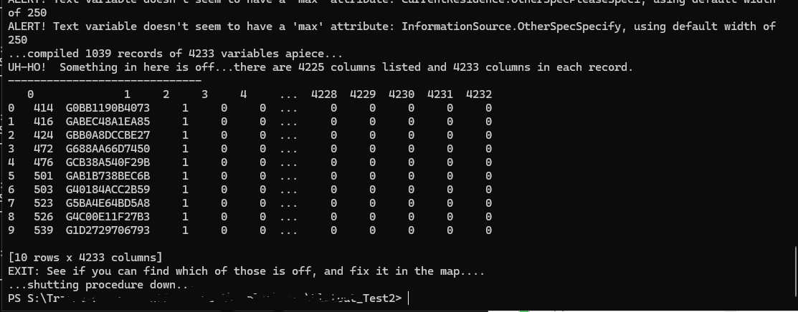
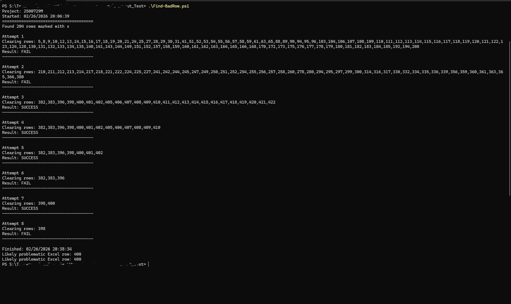

# Flatout-TrialAndError-Automated

The tool that automates Flatout debugging.

The tool tries to uncheck rows from "include" column iteratively, starting from first half, seeing if it helps, then splitting by half again, and so on continueing with "binary search". Basically, same as what FindMinRimLimit() is doing.

As a result, it prints line number, that is absolute line number in Excel, 1-based. So line 400 means AI400-AN400 cells.

When Flatout tool is crashing, the error message does not tell much. We can try excluding certain part of the map trying to locate the row that causes issues, but it takes enormous amount of time. If you see that "UH-HO!", that's total tradegy. There isn't anything we can do, other than spend many hours with blind attempts trying to update something. Hopefully this process can be automated.

This tool is in PowerShell and is fully vibecoded. I was only writing the prompt, not programming this.

So, if you see this

Just start this powershell script, and it does all the work for you.
As the map will be overwritten for every attempt - it has to be with that exact strict name in order for Flatout to run - rename the map to .ORIGINAL.xlsx first.
You can adjust other parameters at the top in powershell script, like the alias name in Flatout call.

Enjoy this beauty. This does all the work for you.

